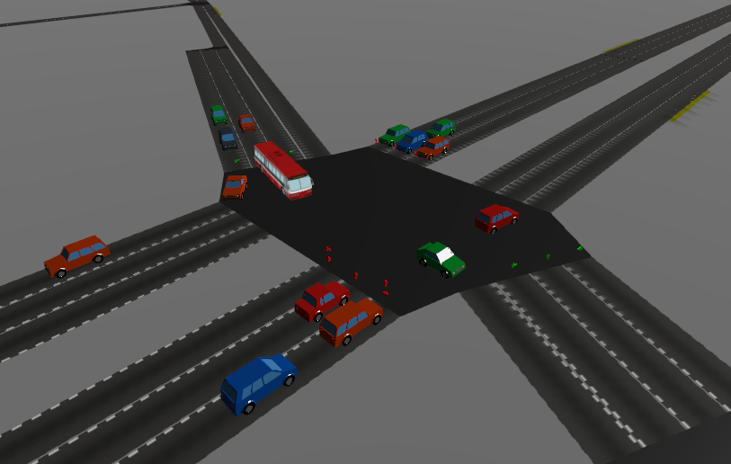
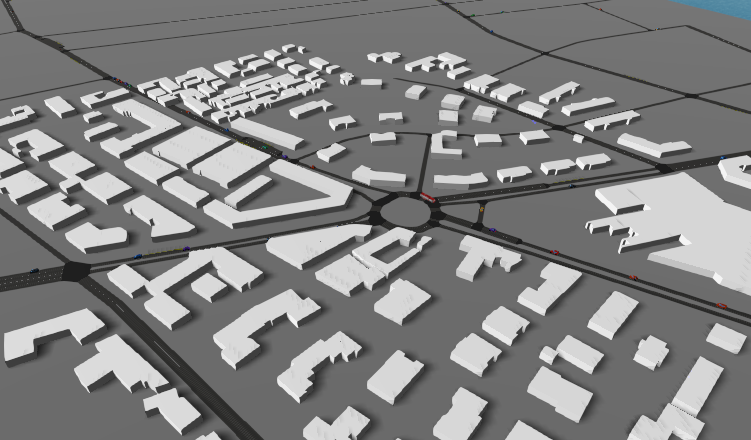
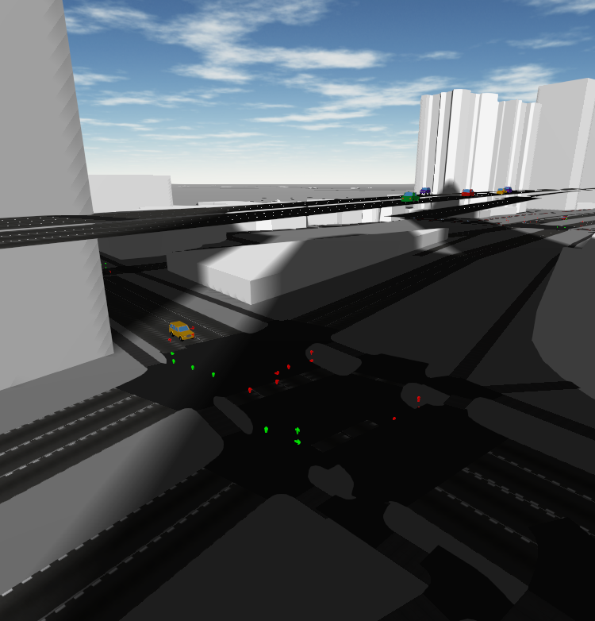

# SUMO-Web3D

Visualization of [SUMO][] in 3D in a web browser using TraCI and three.js.

## Setup

SUMO-Web3D is available on PyPI:

    pip install sumo-web3d
    sumo-web3d
    # then open http://localhost:5000 in your browser

You'll need to have SUMO installed and the `SUMO_HOME` environment variable set.

To run your own simulations, use the `-c` command line argument:

    sumo-web3d -c path/to/your/simulation.sumocfg

## Usage

When you start `sumo-web3d`, it runs `sumo` as a subprocess and starts your simulation.

You can interact with the visualization using the mouse or the keyboard:

- Mouse
    - Click and drag to pan around the visualization.
    - Right-click and drag to rotate.
    - Use the mouse wheel to zoom in and out.
- Keyboard
    - `h`/`l` or `a`/`d` pan the camera left and right
    - `j`/`k` or `w`/`s` move the camera forward or backward
    - `↑`/`↓` rotate the camera up or down
    - `←`/`→` rotate the camera left and right
    - `ctrl` + `↑`/`↓` move the camera up and down

You can send valid arguments and flags to the SUMO executable.

    sumo-web3d --sumo-args '--scale 10 --step-length 0.1'

* `--scale 10`:
    Increase the number of vehicles defined in the route file by 10x.
* `--step-length 0.1`:
    Each frame should advance by 0.1s, rather than the default of 1s. This results in smoother animation.

## Development

SUMO-Web3D is written in Python (Python3) and TypeScript.

To get going, we recommend setting up a Python virtual environment:

    python -m venv $name_of_virtual_environment
    source $name_of_virtual_environment/bin/activate

Then install both Python and JS dependencies:

    pip install -r requirements.txt
    yarn

Download SUMO following the OS-specific [build instructions][downloading] in the SUMO
documentation. Note that pre-compiled downloads exist for Windows and Linux, but Mac
users will likely have to download and compile their own binaries. If you're a Mac user,
watch out for any yellow "this is broken, do something else" messages to save some time.

After downloading SUMO, you'll need to declare the installation directory as an environment
variable (`$SUMO_HOME`) so the generation scripts have access to the tools included with your
installation. To do this, include a line such as the following to your `~/.bash_profile` (adjust
it depending on your path and directory name):

    export SUMO_HOME=$HOME/git/sumo-0.31.0

### Up and Running

Build the client-side JavaScript bundle:

    yarn webpack

Run the server:

    python sumo_web3d/sumo_web3d.py

Then visit http://localhost:5000/ to view the built-in scenarios.

If you want to load a specific SUMO configuration, use the `-c` flag:

    python sumo_web3d/sumo_web3d.py -c path/to/your/scenario.sumocfg

If you'd like to iterate on the frontend code, run:

    yarn develop

instead of `yarn webpack` and `python sumo_web3d/sumo_web3d.py`.

### Run to visualize Flow
First do 

`python flow/visualize/visualizer_rllib.py "path-to-pkl-file" "checkpoint num" --run "Algorithm" --num_rollouts "num_rollouts"` --render --num_clients 2

and then run 

`python sumo_web3d/sumo_web3d.py --sumo-port "port_num" -c 
"path to sumo.cfg"`

You can get the port num by running "ps aux | grep sumo" and picking the one with num-clients = 2

### Architecture

There are three main components of the SUMO-Web3D visualization:

1. **SUMO**
    SUMO-Web3D runs SUMO as a subprocess. Any simulation that runs in SUMO should run with
    SUMO-Web3D.
2. **SUMO-Web3D Server**
    The SUMO-Web3D server is a python process that communicates with SUMO using TraCI.
    It maintains a list of vehicles and people in the simulation and sends frame-by-frame
    diffs to the client. It also reformats SUMO network files for consumption by the client.
3. **SUMO-Web3D Client**
    The visualization itself is written using TypeScript, React and three.js. It reads the
    network and shape data for the simulation and produces a 3D scene. It then applies the
    updates as they come in over the network. Communication with the server happens via a
    websocket.

### Adding a new scenario to the server

You can add custom SUMO simulations to appear in the scenario dropdown. In order to so, you must
update the `scenarios.json` file with the required information. Any scenario must have a name that
(when hyphen-cased) is unique from all the others. The scenario must also have a valid path to
the `.sumocfg` file.

    [
        {
            "name": "pedestring striping",
            "description": "Demonstration of pedestrian congestion in crosswalks",
            "config_file": "tests/pedestrian-striping/test.sumocfg"
        },
        {
            "name": "person_number",
            "description": "Demonstration of a person gettin on and off the bus",
            "config_file": "tests/person_number/person_number.sumocfg"
        }
    ]

### Adding more SUMO unit tests

For development, it's often easier to use SUMO unit tests rather than a larger simulation like
Toronto. To do so, clone SUMO and build the examples:

    git clone https://github.com/planetsumo/sumo.git
    cd sumo

If on Mac, install dependencies:

    brew install automake xerces-c gdal cmake libtool pkg-config
    brew cask install xquartz
    brew install fox

And then build:

    cmake CMakeLists.txt
    make -f Makefile.cvs
    export CPPFLAGS="-I/opt/X11/include $CPPFLAGS"; export LDFLAGS="-L/opt/X11/lib $LDFLAGS"
    ./configure && make
    make examples

If that didn't work, check [SUMO build documentation][sumobuild] to debug.

Then to add the desired scenario to the scenario.json file, e.g.:

    {
        "name": "cross3ltl",
        "description": "An interesection with multi-lane roads and traffic lights",
        "config_file": "$SUMO_HOME/examples/sumo/simple_nets/cross/cross3ltl/test.sumocfg"
    }

When you next run the microsim, the unit test should be available:

    python sumo_web3d/sumo_web3d.py --sumo-args '--step-length 0.1 --scale 3'

### Feature Overview

The visualization has several core features useful for exploring and debugging. Developers should
verify these features work as expected before submitting a pull request.

1. **Scenario dropdown:**
    The sidebar contains a dropdown field that lets you seamlessly switch
    among different SUMO configurations without restarting the server. Selecting a scenario will
    reload the page and start the new scenario from timestamp 0.
1. **Simulation controls:**
    The sidebar contains controls for pausing/resuming and canceling/restarting the simulation. A
    slider lets you control the speed.
1. **Camera Controls:**
    You can zoom and pan around the simulation in 3D with a keyboard, mouse, or trackpad.
1. **Quick Find panel:**
    This panel contains buttons that will move the camera to a random object in the simulation.
    You can choose from any type of supported vehicle, pedestrians, and traffic lights. If smoke
    testing, be sure to try out all three since they work slightly differently.
1. **Statistics:**
    The sidebar displays the following statistics to describe the current state of simulation:
    vehicle counts, payload size, and timestamp.
1. **Click details:**
    When you click on a point, the sidebar will display information about the objects at that
    point, including edges, vehicles, and links to view that point on other mapping platforms.
    Clicking on a vehicle or pedestrian will also display in the sidebar some live-updating
    details about their position.
1. **Vehicle following:**
    When you click on a vehicle or pedestrian, the click details in the sidebar will contain a
    button to follow that vehicle. Following a vehicle locks the camera on that vehicle’s path
    until you unfollow it or it is removed from the scene.
1. **Show route:**
    When you click on a vehicle, you will also see in the sidebar an option to show its route.
    Toggling this option will highglight the vehicle's route from starting edge to destination edge.
1. **Memory management:**
    Vehicles and pedestrians are deleted in memory as they complete their routes. The simulation
    should be able to reach completion without crashing or freezing. To verify, run the Toronto
    simulation until all vehicles and pedestrians have arrrived at their destination. When adding
    new scenarios, run them till their simulation end time (managed by duarouter) to check against
    leaks.

[sumo]: http://sumo.dlr.de/wiki/SUMO_User_Documentation
[downloading]: http://sumo.dlr.de/wiki/Developer/Main#Build_instructions
[xquartz]: https://www.xquartz.org/
[sumobuild]: https://github.com/planetsumo/sumo#build-and-installation
[extract]: https://mapzen.com/data/metro-extracts/metro/toronto_canada/101735835/Toronto/
[osmconvert]: http://wiki.openstreetmap.org/wiki/Osmconvert
[design-doc]: https://docs.google.com/document/d/1JTLETGdZMA2y8b9HGhedPcYFg6SQ4NSqdXtSmFKIlkI/edit
